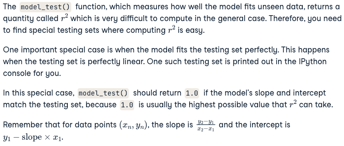

# Chapter 4 - Test Organization and Execution


## Beyond assertion: setup and teardown

#### Instructions


## Use a fixture for a clean data file
In the video, you saw how the preprocess() function creates a clean data file.

The get_data_as_numpy_array() function takes the path to this clean data file as the first argument and the number of columns of data as the second argument. It returns a NumPy array holding the data.

In a previous exercise, you wrote the test test_on_clean_file() without using a fixture. That's bad practice! This time, you'll use the fixture clean_data_file(), which

creates a clean data file in the setup,
yields the path to the clean data file,
removes the clean data file in the teardown.
The contents of the clean data file that you will use for testing is printed in the IPython console.

pytest, os, numpy as np and get_data_as_numpy_array() have been imported for you.
#### Instructions
- Add the correct decorator that would turn clean_data_file() into a fixture.
- Pass an argument to the test test_on_clean_file() so that it uses the fixture.
- Pass the clean data file path yielded by the fixture as the first argument to the function get_data_as_numpy_array().

## Write a fixture for an empty data file
When a function takes a data file as an argument, you need to write a fixture that takes care of creating and deleting that data file. This exercise will test your ability to write such a fixture.

get_data_as_numpy_array() should return an empty numpy array if it gets an empty data file as an argument. To test this behavior, you need to write a fixture empty_file() that does the following.

Creates an empty data file empty.txt relative to the current working directory in setup.
Yields the path to the empty data file.
Deletes the empty data file in teardown.
The fixture will be used by the test test_on_empty_file(), which is available for you to see in the script.

os, pytest, numpy as np and get_data_as_numpy_array have been imported for you.
#### Instructions
- In the setup, assign the variable file_path to the correct string.
- After the setup, yield the variable file_path so that the test can use it.
- In the teardown, remove the file.


## Fixture chaining using tmpdir
The built-in tmpdir fixture is very useful when dealing with files in setup and teardown. tmpdir combines seamlessly with user defined fixture via fixture chaining.

In this exercise, you will use the power of tmpdir to redefine and improve the empty_file() fixture that you wrote in the last exercise and get some experience with fixture chaining.
#### Instructions
- Add the correct argument to the fixture empty_file() so that it chains with the built-in fixture tmpdir.
- Use the appropriate method to create an empty file "empty.txt" inside the temporary directory created by tmpdir.

## Mocking

#### Instructions


## Program a bug-free dependency
In the video, row_to_list() was mocked. But preprocess() has another dependency convert_to_int(). Generally, its best to mock all dependencies of the function under test. It's your job to mock convert_to_int() in this and the following exercises.

The raw data file used in the test is printed in the IPython console. The second row "1,767565,112\n" is dirty, so row_to_list() will filter it out. The rest will be converted to lists and convert_to_int() will process the areas and prices.

The mocked convert_to_int() should process these areas and prices correctly. Here is the dictionary holding the correct return values.
``````
{"1,801": 1801, "201,411": 201411, "2,002": 2002, "333,209": 333209, "1990": None, "782,911": 782911, "1,285": 1285, "389129": None}
``````
#### Instructions
- Define a function convert_to_int_bug_free() which takes one argument called comma_separated_integer_string.
- Assign return_values to the dictionary holding the correct return values in the context of the raw data file used in the test.
- Return the correct return value by looking up the dictionary return_values for the key comma_separated_integer_string.

## Mock a dependency
Mocking helps us replace a dependency with a MagicMock() object. Usually, the MagicMock() is programmed to be a bug-free version of the dependency. To verify whether the function under test works properly with the dependency, you simply check whether the MagicMock() is called with the correct arguments and in the right order.

In the last exercise, you programmed a bug-free version of the dependency data.preprocessing_helpers.convert_to_int in the context of the test test_on_raw_data(), which applies preprocess() on a raw data file. The data file is printed out in the IPython console.

pytest, unittest.mock.call, preprocess raw_and_clean_data_file and convert_to_int_bug_free has been imported for you.
#### Instructions
- In the test test_on_raw_data(), add the correct argument that enables the use of the mocking fixture.
- Replace the dependency "data.preprocessing_helpers.convert_to_int" with the bug-free version convert_to_int_bug_free() by using the correct method and side effect.
- Use the correct attribute which returns the list of calls to the mock, and check if the mock was called with this sequence of arguments: "1,801", "201,411", "2,002", "333,209", "1990", "782,911", "1,285", "389129".


## Testing models

#### Instructions


## Testing on linear data

#### Instructions
- Assign the variable test_argument to a NumPy array holding the perfectly linear testing data printed out in the IPython console.
- Assign the variable expected to the expected value of r**2 in the special case of a perfect fit.
- Fill in with the model's slope and intercept that matches the testing set.
- Remembering that actual is a float, complete the assert statement to check if actual returned by model_test() is equal to the expected return value expected.

## Testing on circular data
Another special case where it is easy to guess the value of  is when the model does not fit the testing dataset at all. In this case,  takes its lowest possible value 0.0.

The plot shows such a testing dataset and model. The testing dataset consists of data arranged in a circle of radius 1.0. The x and y co-ordinates of the data is shown on the plot. The model corresponds to a straight line y=0.

As one can easily see, the straight line does not fit the data at all. In this particular case, the value of  is known to be 0.0.

Your job is to write a test test_on_circular_data() for the function model_test() that performs this sanity check. pytest, numpy as np, model_test, sin, cos and pi have been imported for you.
#### Instructions
- Assign test_argument to a  NumPy array holding the circular testing data shown in the plot, starting with (1.0, 0.0) and moving anticlockwise.
- Fill in with the slope and intercept of the straight line shown in the plot.
- Remembering that model_test() returns a float, complete the assert statement to check if model_test() returns the expected value of  in this special case.


## Testing plots

#### Instructions


## Generate the baseline image

#### Instructions


## Run the tests for the plotting function

#### Instructions


## Fix the plotting function

#### Instructions
